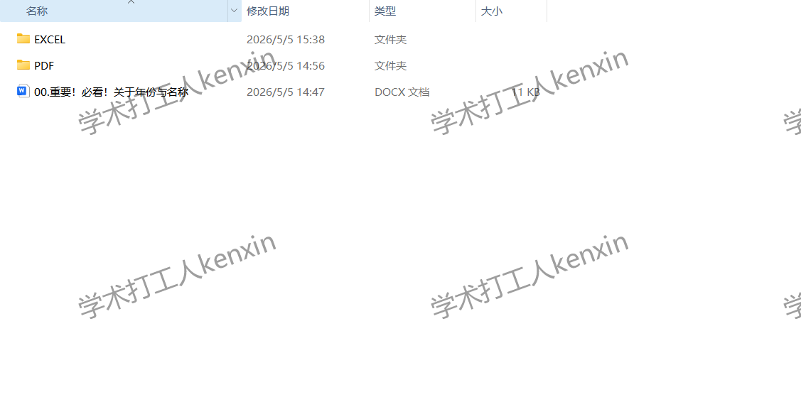
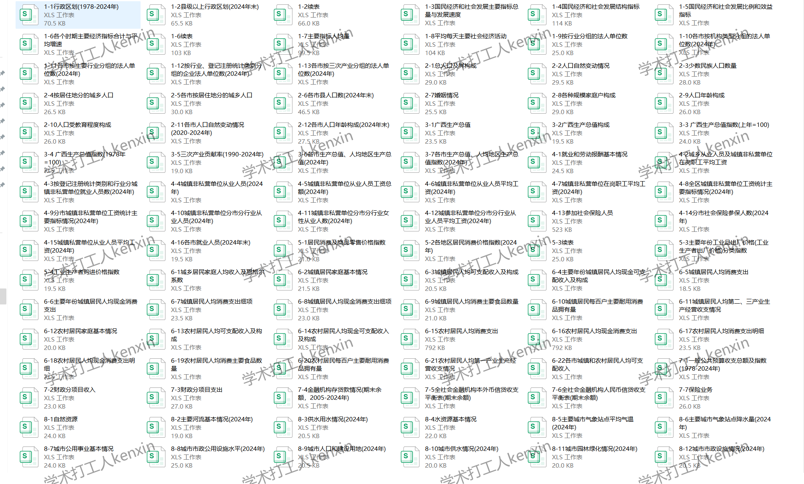
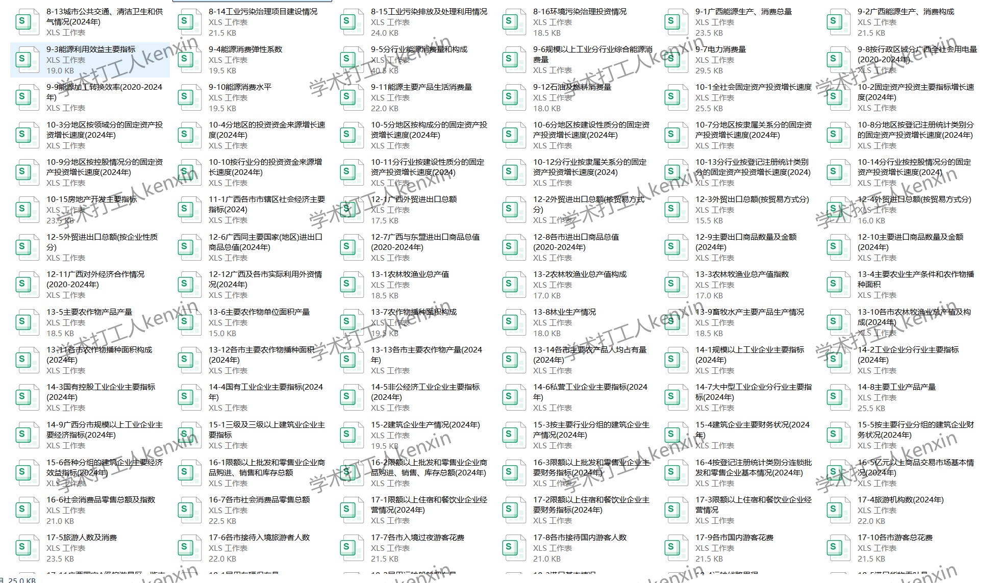
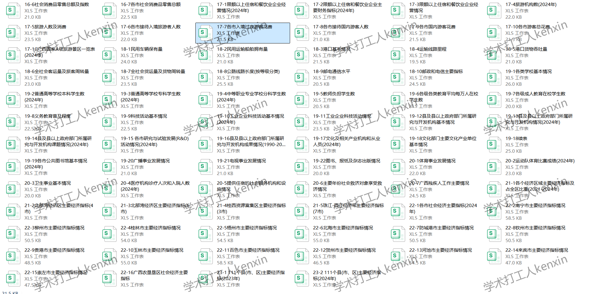

## Body

"Guangxi Statistical Yearbook" (1985-2025)

Data year: The yearbook covers the years from 1985 to 2025. (The data year should be one less than the actual yearbook year).
All are original yearbooks, not pre-compiled panel data! Please read carefully before purchasing and understand that there will be no returns or exchanges after purchase.

01. Data Introduction
"Guangxi Statistical Yearbook"

02. Indicator Details
The directory is displayed in the picture for reference. It is based on the actual content of the yearbook. Please refer to it yourself and make your own purchase decision. If you need help finding data, all information is here. After shipment, we do not support return without reason.
The display directory is for 2025, for reference only. Different statistical口径 may change from year to year. For academic knowledge, please note.

03. Data Format
Format: pdf and excel from 1985 to 2023, excel for 2024, and a CD edition for 2025.

## Images

item_1071656644535

Here is a pay link on Stripe ( https://buy.stripe.com/3cs8yP7sY87d0vu9AB ). Please contact me lonlonago@foxmail.com after funding $89, and I will send you a complete data files , thank you!

